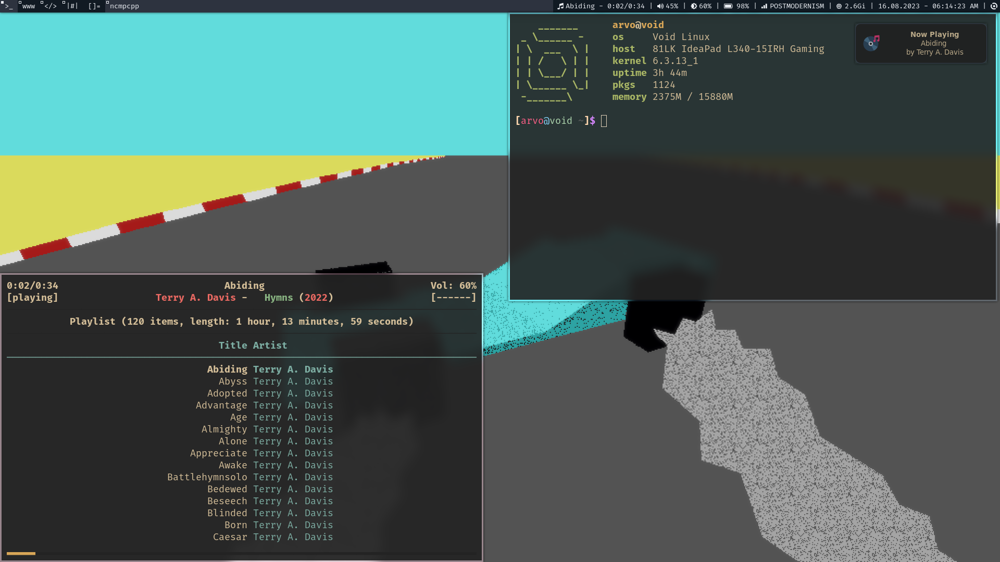
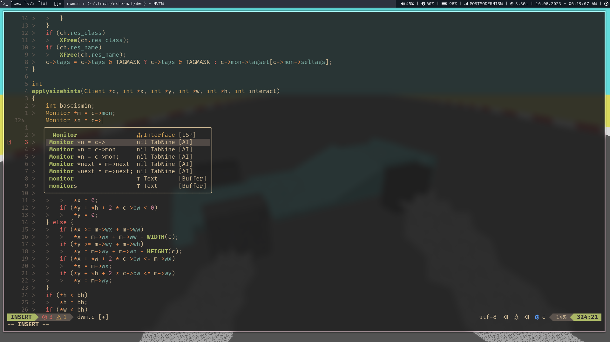

## WARNING
-----------

I did not update *setmeup.sh*, **do not** execute it to set up a base void install.

Though all other files are up to date, screenshots are only deprecated with colorschemes in dwm and vim.

README will be updated when all is ready.

## My Minimal Void Linux Desktop
--------------------------------

Desktop dotfiles, scripts and other apps for portable dev environment.

Configs for:
* btop
* cava
* dunst
* firefox
* gtk-3.0
* htop
* mpd
* mpv
* ncmpcpp
* nvim
* qutebrowser
* ranger
* sxhkd
* zathura

#### Usage
----------
Dotfiles are general for all distros, setmeup.sh installs packages using the xbps package manager.

Desktop currently uses:
* dwm
* dmenu
* slock
* st
* slstatus

#### How It Looks Like
----------------------

Desktop with terminal

Desktop with nvim

#### Then
---------
*setmeup.sh* is meant to be used for/after a base install when a connection to a network is established.

Run *setmeup.sh* inside `HOME/repo`.
